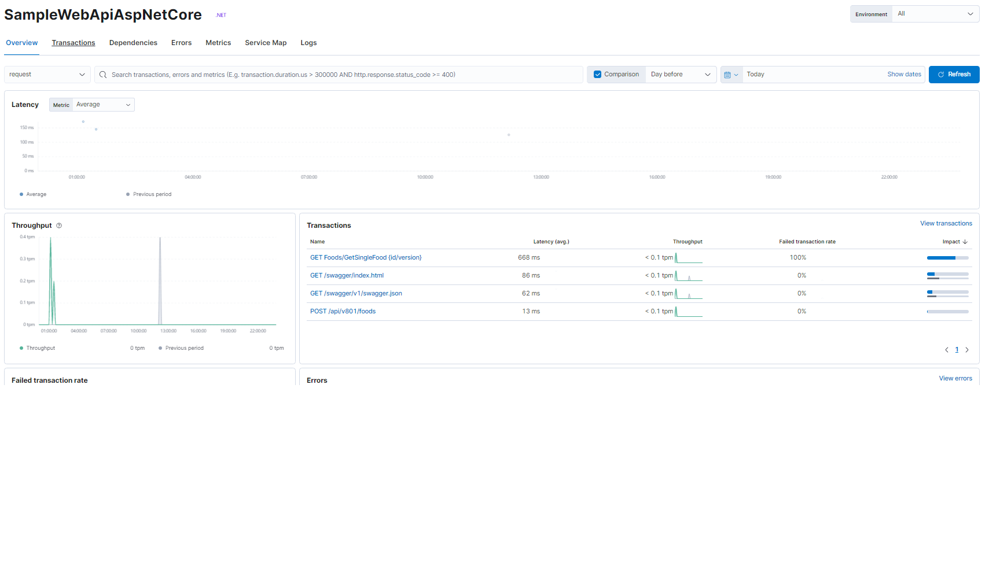
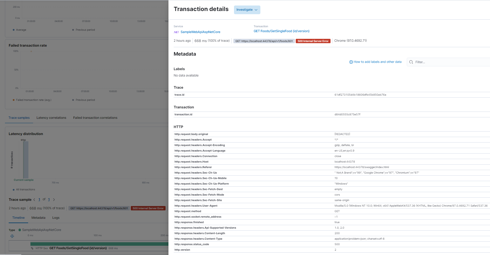

# Monitoring .NET Applications with Elastic APM

In this, I would like to showcase steps to monitor a .net application with Elastic APM. 


### Pre-requisites

    - ElasticSearch server should be up and running
    - Kibana server should be up and running.
    - Elastic APM server should be up and running.


### Nuget Packages to be installed

- Elastic.Apm.All
    - This package automatically pulls in ASP.net Core and Entity Framework Core auto instrumentation with the Elastic APM.net Agent. 


### Startup.cs file

Include ```app.UseElasticApm();``` in the Configure method of the Startup.cs file. With this minimal code, Elastic APM will start monitoring the application. 

```C#
  public void Configure(
            IApplicationBuilder app, 
            ILoggerFactory loggerFactory, 
            IWebHostEnvironment env, 
            IApiVersionDescriptionProvider provider)
        {
            app.UseElasticApm();
            ....................    
            ....................
            ....................
        }            
```

### Kibana Dashboard

Navigate to Kibana Dashboard & go to Observability > Overview Page. From there, navigate to APM > Services page

You should see your application name appearing as the Service name there. Click the service name

You should be able to monitor the application with parameters such as **Latency**, **Throughput**, **Transactions**, **Errors**, **Failed Transaction Rates** and many more...


You can also see the **Traces** of all the transactions done during the application monitoring.



