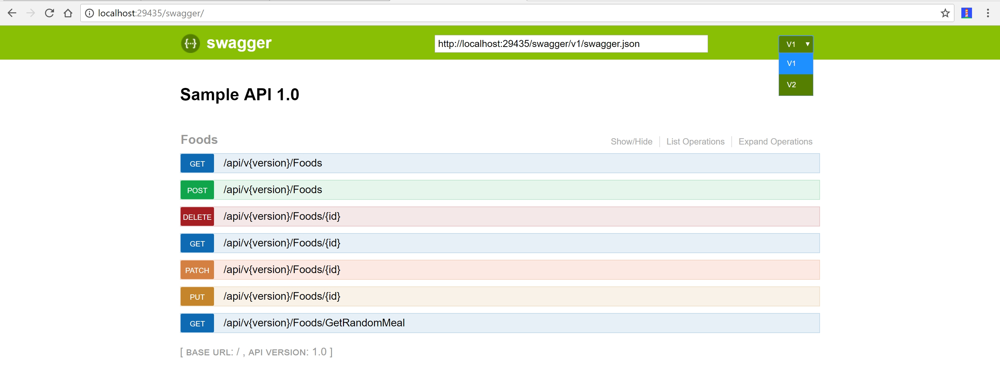
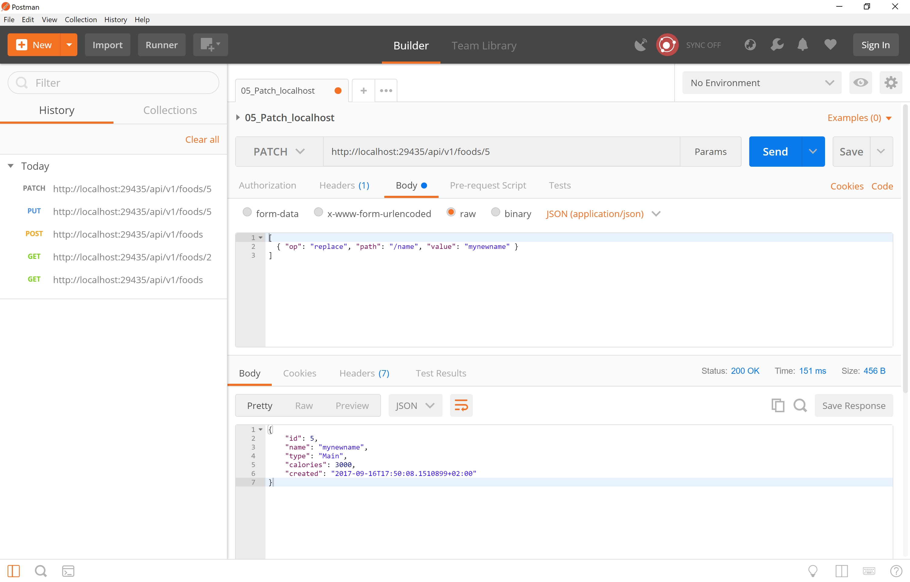
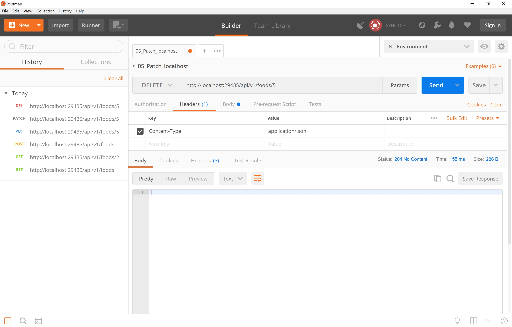

# ASP.NET Core WebApi Logging with SeriLog and ELK stack

In this repository I want to give a plain starting point at how to log into ElasticSearch using SeriLog and view logs in Kibana ( ELK stack ).

This lets us find what exactly is going on with the system at any given point of time and helps us build a scalable and filterable system.  

In this repository, am using a sample ASP.net code that contains a controller which is dealing with FoodItems. You can GET/POST/PUT/PATCH and DELETE them.   

## Versions

``` http://localhost:29435/swagger ```




## Pre-requisites
- Asp.net Sample code should be running on the system
- ElasticSearch should be installed and accessible at "http://your-elasticsearch-url:9200"
- Kibana should be installed and accessible at "http://your-kibana-url:5601"


## Nuget Packages to be installed

- Serilog.AspNetCore
  - This package also brings in a bunch of enrichers that automatically start to install any request in our system.

- Serilog.Sinks.ElasticSearch
  - This is where we are going to push the data in to Elastic Search

- Serilog.Enrichers.Environment


## appsettings.json file

Update the Logging section with below code:

```json
  "ApplicationName":  "your app-name",
  "Serilog": {
    "MinimumLevel": {
      "Default": "Information",
      "Override": {
        "Microsoft": "Information",
        "System": "Warning"
      }
   }
```

Add the ElasticSearch configuration to the appsettings.json file

```json
"ElasticConfiguration": {
    "Uri": "http://your-elasticsearch-url:9200"
  },
```

## Program.cs file

Under your Host.CreateDefaultBuilder(args) method, add the following code to make this mechanism work

```C#
.UseSerilog(configureLogger:(context, configuration) => 
               {
                   configuration.Enrich.FromLogContext()
                        .Enrich.WithMachineName()                
                        .WriteTo.Console()
                        .WriteTo.Elasticsearch(new ElasticsearchSinkOptions(new Uri(context.Configuration["ElasticConfiguration:Uri"]))
                        {
                            IndexFormat = $"{context.Configuration["ApplicationName"]}-logs-{context.HostingEnvironment.EnvironmentName?.ToLower().Replace(".", "-")}-{DateTime.UtcNow:yyyy-MM}",

                            AutoRegisterTemplate = true,
                            NumberOfShards = 2,
                            NumberOfReplicas = 1
                        })
                        .Enrich.WithProperty("Environment", context.HostingEnvironment.EnvironmentName)
                        .ReadFrom.Configuration(context.Configuration);

               })
```


## PUT a foodItem

``` http://localhost:29435/api/v1/foods/5 ```

``` javascript
{
    "name": "Lasagne2",
    "type": "Main",
    "calories": 3000,
    "created": "2017-09-16T17:50:08.1510899+02:00"
}
```


## PATCH a foodItem

``` http://localhost:29435/api/v1/foods/5 ```

``` javascript
[
  { "op": "replace", "path": "/name", "value": "mynewname" }
]
```



## DELETE a foodItem

``` http://localhost:29435/api/v1/foods/5 ```



